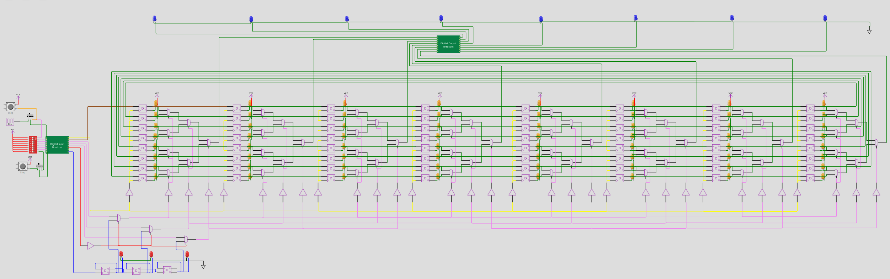
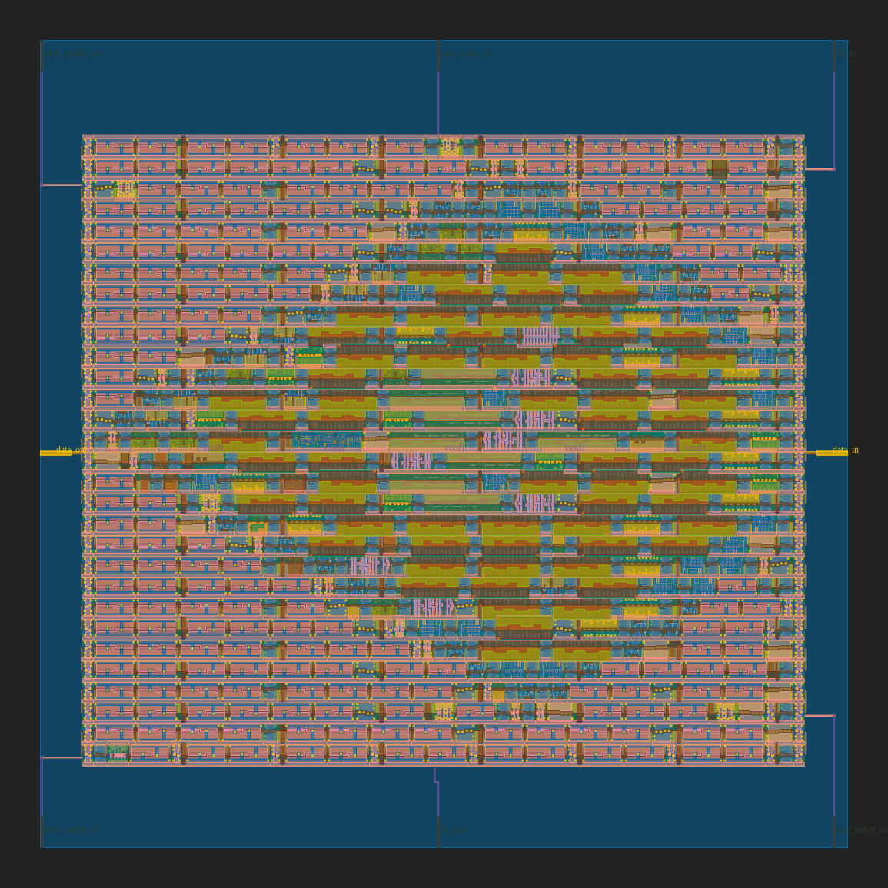

# 8x8 Bit Pattern Player

## TinyTapeout

This repository contains a mikrochip design done for TinyTapeout.
Go to https://tinytapeout.com for more informations.

The design is included on the SKY130 shuttlerun MPW-7 with the TinyTapeout project:
https://github.com/mattvenn/tinytapeout-mpw7
https://platform.efabless.com/projects/shuttle_11

## Wokwi project

https://wokwi.com/projects/341620484740219475

## Information about the design

author:       "Thorsten Knoll"

title:        "8x8 Bit Pattern Player"

description:  "8x8 bit serial programmable, addressable and playable memory."

how_it_works: "The 8x8 memory is a 64-bit shiftregister, consisting of 64 serial chained D-FlipFlops (data: IN0, clk_sr: IN1). 8 memoryslots of each 8 bit can be directly addressed via addresslines (3 bit: IN2, IN3, IN4) or from a clockdriven player (3 bit counter, clk_pl: IN7). A mode selector line (mode: IN5) sets the operation mode to addressing or to player. The 8 outputs are driven by the 8 bit of the addressed memoryslot."

how_to_test:  "Programm the memory: Start by filling the 64 bit shiftregister via data and clk_sr, each rising edge on clk_sr shifts a new data bit into the register. Select mode: Set mode input for direct addressing or clockdriven player. Address mode: Address a memoryslot via the three addresslines and watch the memoryslot at the outputs. Player mode: Each rising edge at clk_pl enables the next memoryslot to the outputs."

external_hw:  "You could programm, address and play the 8x8 Bit Pattern Player with a breadboard, two clock buttons and some dipswitches on the input side. Add some LED to the output side. Just like the WOKWI simulation."
language:     "wokwi"

wokwi_id:     341620484740219475

pictures:

inputs:
  * data
  * clk_sr
  * address_0
  * address_1
  * address_2
  * mode
  * none
  * clk_pl

outputs:
  * bit 0
  * bit 1
  * bit 2
  * bit 3
  * bit 4
  * bit 5
  * bit 6
